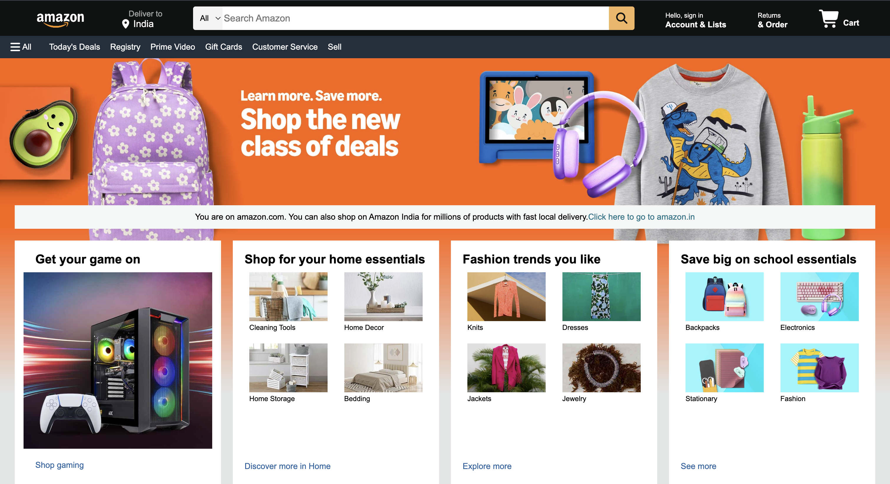
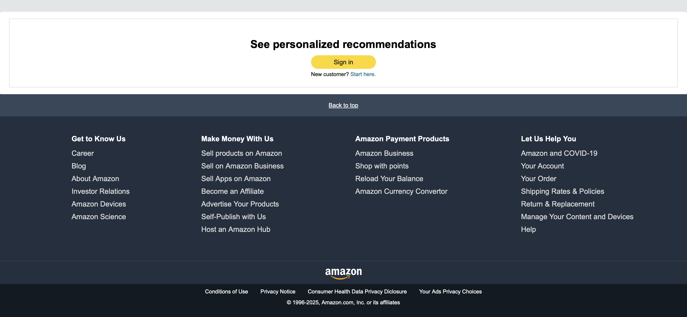

# 🛒 Amazon.com Clone

 
 

A front-end clone of Amazon’s landing page built using HTML and CSS.
This project replicates the layout, design, and responsive structure of Amazon’s homepage with a navigation bar, hero section, product showcases, and footer.

## 📌 Features

- Navigation Bar
  - Amazon logo
  - Delivery location section
  - Search bar with category dropdown
  - Sign-in, Orders & Cart options
- Secondary Panel
  - Quick access links: Today’s Deals, Registry, Prime, Gift Cards, Customer Service, etc.
- Hero Section
  - Large banner image with promotional text
- Shop Section
  - Multiple product category cards (gaming, fashion, school essentials, kitchen, etc.)
  - Grid-based layout with hover effects
- Books Carousel
  - Horizontal scroll section for Best Sellers in Books
- Footer
  - Sign-in prompt
  - Multi-column Amazon info section
  - Back to top button
  - Footer with legal links and copyright
 
## 🎥 Preview 

Here’s a quick look at the project:

## 🖼️ Project Structure

📂 E-Commerce-Website
┣ 📜 index.html
┣ 📂 css
┃ ┣ navbar.css
┃ ┣ panel2.css
┃ ┗ main.css
┣ 📂 images
┃ ┣ logo.png
┃ ┣ banner.jpg
┃ ┗ product1.png

## 🛠️ Tech Stack

<table>
  <tr>
    <td><b>HTML5</b> – Structure of the website</td>
    <td></td>
  </tr>
  <tr>
    <td><b>CSS3</b> – Styling and layout (navbar.css, panel2.css, main.css)</td>
    <td></td>
  </tr>
  <tr>
    <td><b>Font Awesome</b> – Icons for cart, search, location, etc.</td>
    <td></td>
  </tr>
</table>

##  Responsiveness

- Built with CSS Grid & Flexbox for layout  
- Media queries ensure compatibility with tablets & desktops  
- Mobile support is basic (to be improved in future updates)  

## 📌 Future Improvements

- [ ] Add JavaScript for interactive features (carousel, dropdowns, cart)
- [ ] Improve mobile responsiveness
- [ ] Add Dark Mode support
